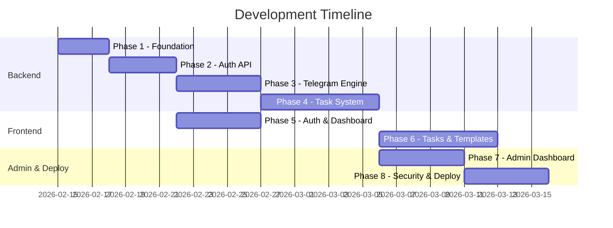

# 📋 Project Phases Roadmap — Telegram Automation Platform

> **Vision**: "Set once, forget forever." — A **Telegram Automation Operating System** where users connect their Telegram once, create automated tasks once, and the system handles everything — daily, weekly, monthly — forever.

---

## Project Context

### The Problem (Origin)

Employees must manually send specific attendance stickers at fixed times every day in a Telegram group. Since Telegram Premium is unavailable, they cannot use Telegram's built-in scheduling. This daily process is **repetitive**, **time-consuming**, and **easy to forget**.

### The Bigger Opportunity

Instead of building a narrow "attendance sticker sender", this project takes the **platform approach**. Attendance automation becomes just one **template** among many. The system supports **any** Telegram automation use case:

| Use Case | Example |
|----------|---------|
| Office Attendance | Duty in/out stickers at fixed times |
| Group Activity | Daily good morning, reminders, status updates |
| Content Posting | Scheduled channel posts, campaign messages |
| Business Notifications | Announcements, offer reminders, event alerts |
| Community Management | Welcome messages, rule reminders, weekly notices |
| Personal Productivity | Study reminders, habit tracking, self-check posts |

### The Solution

A VPS-hosted **Telegram Automation Platform** where users:
1. Connect their Telegram accounts once
2. Create **Tasks** — any automated action (sticker, text, photo, video, document, forward)
3. Configure **when** (daily/weekly/monthly/custom), **where** (group/channel), and **what** (content)
4. Set skip days (holidays, leave, pauses)
5. The system runs everything automatically — forever

### Architecture Summary

| Layer      | Technology                                      |
|------------|--------------------------------------------------|
| Backend    | Python + Telethon/Pyrogram + FastAPI + APScheduler + Queue/Worker |
| Frontend   | React (Vite) + shadcn + Tailwind + Zod + RHF    |
| Database   | MongoDB Atlas                                    |
| Hosting    | VPS (24/7 running)                               |

### Available Skills (Best Practices to Follow)

| Skill | When to Apply |
|-------|---------------|
| `rest-api-design` | Phase 2, 3, 4, 7 — API endpoint design (resource naming, status codes, error responses, versioning) |
| `python-performance-optimization` | Phase 3, 4, 8 — Scheduler engine, background workers, async I/O, production performance |
| `vercel-react-best-practices` | Phase 5, 6, 7 — React components, bundle optimization, re-renders, client-side data fetching |

---

## Phase 1 — Project Foundation & Environment Setup

### Purpose
Establish the development environment, project structure, dependency management, and tooling so that all subsequent phases have a solid, consistent foundation to build upon.

### Previously
Nothing exists yet — this is a fresh project with only a `project_overview.md`, a `roadmap.md`, and skill reference files.

### Intention
Create a well-organized directory layout with separate `backend/` and `frontend/` folders. Install all core dependencies, configure linters/formatters, set up environment variable management, and establish the Git workflow.

### Result
A fully configured development environment where both the Python backend and React frontend can be started locally with a single command each. All tooling (linting, formatting, env management) is in place.

### Tasks

#### 1.1 — Backend Foundation
- [ ] Create `backend/` directory structure:
  ```
  backend/
  ├── app/
  │   ├── __init__.py
  │   ├── main.py              # Entry point
  │   ├── config.py            # Environment config
  │   ├── database.py          # MongoDB connection
  │   ├── models/              # Database models
  │   ├── routes/              # API route handlers
  │   ├── services/            # Business logic
  │   ├── middleware/           # Auth, rate limiting
  │   ├── scheduler/           # Background job scheduler
  │   ├── workers/             # Task execution workers
  │   ├── templates/           # Task template definitions
  │   └── utils/               # Helpers, encryption
  ├── requirements.txt
  ├── .env.example
  └── .env
  ```
- [ ] Initialize Python virtual environment
- [ ] Install core dependencies:
  - `fastapi` (REST API framework)
  - `uvicorn` (ASGI server)
  - `motor` (async MongoDB driver)
  - `telethon` or `pyrogram` (Telegram userbot library)
  - `apscheduler` (background scheduler)
  - `python-jose` + `passlib` (JWT auth + password hashing)
  - `python-dotenv` (environment variables)
  - `cryptography` (session encryption)
  - `pydantic` (data validation)
- [ ] Create `.env.example` with all required environment variables:
  - `MONGO_URI`, `JWT_SECRET`, `ENCRYPTION_KEY`, `TELEGRAM_API_ID`, `TELEGRAM_API_HASH`
- [ ] Set up basic `config.py` to load and validate environment variables

#### 1.2 — Frontend Foundation
- [ ] Initialize React project with Vite in `frontend/` directory:
  - `npx -y create-vite@latest ./frontend --template react`
- [ ] Install core dependencies:
  - `shadcn/ui` components
  - `tailwindcss` + configuration
  - `react-hook-form` + `@hookform/resolvers`
  - `zod` (schema validation)
  - `react-hot-toast` (notifications)
  - `axios` (HTTP client)
  - `react-router-dom` (routing)
- [ ] Configure Tailwind with custom theme (dark mode support, mobile-first breakpoints)
- [ ] Set up project structure:
  ```
  frontend/src/
  ├── components/          # Reusable UI components
  │   ├── ui/              # shadcn components
  │   └── layout/          # Layout wrappers
  ├── pages/               # Page components
  ├── hooks/               # Custom React hooks
  ├── services/            # API service layer
  ├── lib/                 # Utilities
  ├── contexts/            # React contexts
  └── schemas/             # Zod validation schemas
  ```

#### 1.3 — Database Setup
- [ ] Create MongoDB Atlas cluster
- [ ] Configure connection string in `.env`
- [ ] Create `database.py` with connection pooling and health check
- [ ] Design initial collections schema (documented, not yet implemented):
  - `users` — system accounts
  - `telegram_accounts` — connected TG accounts
  - `tasks` — automated task configurations (replaces old "schedules")
  - `task_templates` — pre-built task templates
  - `off_days` — global and per-task skip days
  - `activity_logs` — execution success/failure records

#### 1.4 — Git & Tooling
- [ ] Set up `.gitignore` for Python + Node artifacts, `.env`, session files
- [ ] Add `README.md` with setup instructions for both backend and frontend
- [ ] Create `docker-compose.yml` (optional, for local MongoDB)

---

## Phase 2 — Authentication & User Management API

> **🔧 Skill**: Apply `rest-api-design` for all endpoint design — resource naming (nouns, plural), proper HTTP methods, status codes, error response format, and input validation.

### Purpose
Build the user registration, login, and session management system that will gate all subsequent features. Without authentication, nothing else can be personalized or secured.

### Previously
Phase 1 is complete — the project structure exists, dependencies are installed, and the database connection is configured.

### Intention
Create a complete auth flow: registration with email/password, login with JWT tokens, middleware for protected routes, and password hashing. Also build the admin role system so that admin-specific features (Phase 7) have a foundation.

### Result
Users can register, log in, receive a JWT token, and use that token to access protected API endpoints. Passwords are never stored in plaintext. Admin users can be distinguished from regular users.

### Tasks

#### 2.1 — User Model
- [ ] Create `User` model in MongoDB:
  ```python
  {
    "_id": ObjectId,
    "email": str,                   # unique, indexed
    "password_hash": str,           # bcrypt hashed
    "role": str,                    # "user" | "admin"
    "is_active": bool,              # account lock status
    "telegram_account_limit": int,  # max TG accounts allowed (default: 3)
    "task_limit": int,              # max tasks allowed (default: 20)
    "timezone": str,                # default timezone (e.g., "Asia/Dhaka")
    "created_at": datetime,
    "updated_at": datetime
  }
  ```
- [ ] Add email uniqueness index
- [ ] Add input validation with Pydantic schemas

#### 2.2 — Auth API Endpoints
Following `rest-api-design` skill — nouns, plural resources, proper status codes:

| Method | Endpoint | Purpose | Status Codes |
|--------|----------|---------|-------------|
| `POST` | `/api/v1/auth/register` | Create new user account | `201`, `400`, `409` |
| `POST` | `/api/v1/auth/login` | Authenticate & return JWT | `200`, `401` |
| `GET` | `/api/v1/auth/me` | Get current user profile | `200`, `401` |
| `PATCH` | `/api/v1/auth/me` | Update profile (timezone, etc.) | `200`, `400`, `401` |
| `POST` | `/api/v1/auth/change-password` | Change password | `200`, `400`, `401` |

- [ ] Implement registration with email validation (format check, uniqueness)
- [ ] Implement login returning JWT access token (with expiry)
- [ ] Implement password hashing with `bcrypt` via `passlib`
- [ ] Implement JWT token generation and verification with `python-jose`

#### 2.3 — Auth Middleware
- [ ] Create `auth_middleware` that:
  - Extracts JWT from `Authorization: Bearer <token>` header
  - Validates token signature and expiry
  - Attaches `current_user` to request context
  - Returns `401` for invalid/missing tokens
- [ ] Create `admin_middleware` that checks `role == "admin"`
- [ ] Create `rate_limit_middleware` to prevent brute force login attempts

#### 2.4 — Error Response Format
Following `rest-api-design` skill — standardized error responses:
```json
{
  "error": {
    "code": "VALIDATION_ERROR",
    "message": "Invalid input data",
    "details": [
      { "field": "email", "message": "Email format is invalid" }
    ]
  }
}
```
- [ ] Create a centralized error handler that formats all errors consistently
- [ ] Ensure all endpoints return proper HTTP status codes

---

## Phase 3 — Telegram Account Connection Engine

> **🔧 Skill**: Apply `python-performance-optimization` for async I/O patterns (Pattern 15) when handling Telegram API calls. Apply `rest-api-design` for endpoint design.

### Purpose
Build the core engine that allows users to connect their Telegram accounts to the system. This is the most critical and sensitive phase because it involves handling real Telegram sessions and login codes.

### Previously
Phase 2 is complete — users can register and log in. The auth middleware protects routes. But users have no Telegram accounts connected yet.

### Intention
Create a multi-step Telegram login flow: user provides phone number → system sends login code via Telegram → user enters code → session is created and encrypted. The session file is stored securely so the system can act as the user on Telegram without re-authentication.

### Result
Users can connect one or more Telegram accounts. Each account has an encrypted session stored on the server. The system can act as the user to perform any Telegram action (send stickers, messages, media, forward messages). Users can view, manage, and disconnect their accounts.

### Tasks

#### 3.1 — Telegram Client Manager
- [ ] Create `TelegramClientManager` service:
  - Manages multiple Telethon/Pyrogram clients
  - One client per connected Telegram account
  - Handles client lifecycle (connect, disconnect, reconnect)
- [ ] Implement session encryption:
  - Encrypt session files using `cryptography.fernet` with `ENCRYPTION_KEY`
  - Store encrypted sessions in a `sessions/` directory (excluded from git)
  - Decrypt only when client needs to connect
- [ ] Implement connection pooling:
  - Keep active clients in memory for accounts with active tasks
  - Lazy-load clients for inactive accounts

#### 3.2 — Telegram Account Model
- [ ] Create `TelegramAccount` model:
  ```python
  {
    "_id": ObjectId,
    "user_id": ObjectId,          # references User
    "phone_number": str,          # +880XXXXXXX
    "telegram_user_id": int,      # Telegram's internal user ID
    "first_name": str,            # from Telegram profile
    "username": str,              # @username if available
    "session_file": str,          # path to encrypted session
    "status": str,                # "active" | "disconnected" | "locked"
    "is_locked_by_admin": bool,   # admin lock flag
    "active_tasks_count": int,    # cached count of active tasks
    "last_activity": datetime,
    "created_at": datetime
  }
  ```
- [ ] Add compound index on `(user_id, phone_number)` for uniqueness
- [ ] Add index on `user_id` for fast lookups

#### 3.3 — Telegram Connection API
| Method | Endpoint | Purpose | Status Codes |
|--------|----------|---------|-------------|
| `GET` | `/api/v1/telegram-accounts` | List user's connected accounts | `200`, `401` |
| `POST` | `/api/v1/telegram-accounts/send-code` | Start login: send code to phone | `200`, `400`, `429` |
| `POST` | `/api/v1/telegram-accounts/verify-code` | Complete login: verify code | `201`, `400`, `401` |
| `GET` | `/api/v1/telegram-accounts/:id` | Get account details | `200`, `401`, `404` |
| `DELETE` | `/api/v1/telegram-accounts/:id` | Disconnect & remove account | `204`, `401`, `404` |
| `POST` | `/api/v1/telegram-accounts/:id/reconnect` | Reconnect a disconnected session | `200`, `400` |

- [ ] Implement the two-step login flow:
  1. `send-code`: Creates a temporary Telethon client, sends login code, stores `phone_code_hash` in a temporary cache (with TTL)
  2. `verify-code`: Verifies the code, completes login, saves encrypted session, creates DB record
- [ ] Enforce `telegram_account_limit` from user profile
- [ ] Handle 2FA (two-factor authentication) if user has it enabled on Telegram
- [ ] Handle `FloodWaitError` from Telegram API with proper retry messaging

#### 3.4 — Telegram Data Fetching APIs
These endpoints allow the frontend to browse groups, channels, and stickers for task setup:

| Method | Endpoint | Purpose |
|--------|----------|---------|
| `GET` | `/api/v1/telegram-accounts/:id/groups` | List user's joined groups & channels |
| `GET` | `/api/v1/telegram-accounts/:id/sticker-sets` | List user's sticker packs |
| `GET` | `/api/v1/telegram-accounts/:id/sticker-sets/:set_id/stickers` | List stickers in a pack |

- [ ] Fetch dialogs/groups/channels using Telethon
- [ ] Fetch and cache sticker set data
- [ ] Return sticker thumbnails for frontend display

#### 3.5 — Session Health Monitoring
- [ ] Create a background task that periodically checks session health:
  - Attempt to connect with each active session
  - Mark `status: "disconnected"` if session is expired/revoked
  - Log health check results
- [ ] Implement auto-reconnect logic for temporarily disconnected sessions

---

## Phase 4 — Generalized Task System & Scheduler Engine

> **🔧 Skill**: Apply `python-performance-optimization` for efficient scheduling (Pattern 12 caching, Pattern 14 multiprocessing, Pattern 15 async I/O). Apply `rest-api-design` for endpoints.

### Purpose
Build the heart of the platform — the **generalized task system** that replaces the old rigid attendance-only model. Users create flexible "Tasks" that can send any content type on any schedule. The background scheduler engine executes these tasks automatically.

### Previously
Phase 3 is complete — users have connected Telegram accounts and can browse their groups, channels, and stickers. But there's no task system, no scheduler, and no automation yet.

### Intention
Build a modular task system where each task specifies: which account, which target, what action, what content, when, how often, and when to skip. The background worker executes tasks at the right times, with retry logic, duplicate prevention, and comprehensive logging. This is the core product differentiator — what makes this a **platform** instead of a single-purpose tool.

### Result
Users can create, edit, enable/disable, and delete automated tasks. The scheduler sends the right content to the right place at the right time. Off days are respected. Failures are retried. Everything is logged. The system recovers gracefully from restarts.

### Tasks

#### 4.1 — Task Model (The Core Data Model)
- [ ] Create `Task` model — the central entity of the platform:
  ```python
  {
    "_id": ObjectId,
    "user_id": ObjectId,
    "telegram_account_id": ObjectId,
    "name": str,                        # user-facing task name
    "description": str,                 # optional description
    
    # Target
    "target": {
      "type": str,                      # "group" | "channel"
      "chat_id": int,                   # Telegram chat ID
      "chat_title": str,               # display name
      "access_hash": int               # Telegram access hash
    },
    
    # Action
    "action_type": str,                 # "send_sticker" | "send_text" | "send_photo" | "send_video" | "send_document" | "forward_message"
    "action_content": {
      # For send_sticker:
      "sticker_set_id": str,
      "sticker_id": str,
      "sticker_emoji": str,
      
      # For send_text:
      "text": str,
      "parse_mode": str,               # "markdown" | "html" | null
      
      # For send_photo/video/document:
      "file_path": str,                # server path to uploaded file
      "caption": str,
      
      # For forward_message:
      "source_chat_id": int,
      "source_message_id": int
    },
    
    # Schedule
    "schedule": {
      "type": str,                     # "daily" | "weekly" | "monthly" | "custom_days" | "specific_dates"
      "time": str,                     # "09:00" (HH:MM 24hr)
      "timezone": str,                 # inherited from user settings, overridable per task
      
      # For weekly:
      "days_of_week": [int],           # [0,1,2,3,4] = Mon-Fri
      
      # For monthly:
      "days_of_month": [int],          # [1, 15] = 1st and 15th
      
      # For custom_days / specific_dates:
      "specific_dates": [str],         # ["2026-02-20", "2026-03-01"]
      
      "random_delay_minutes": int      # optional: randomly add 0-N minutes delay (Anti-Ban)
    },
    
    # Anti-Ban Settings
    "simulate_typing": bool,           # true = show "typing..." status before sending
    
    # Skip days
    "skip_days": {
      "weekly_holidays": [int],        # 0=Monday, 6=Sunday
      "specific_dates": [str]          # ["2026-03-26"]
    },
    
    # Status
    "is_enabled": bool,                # master on/off
    "status": str,                     # "active" | "paused" | "error"
    "last_execution": datetime,
    "next_execution": datetime,
    "template_id": str,                # null or template reference
    
    "created_at": datetime,
    "updated_at": datetime
  }
  ```
- [ ] Add indexes: `(user_id)`, `(telegram_account_id)`, `(is_enabled, next_execution)`

#### 4.2 — Task CRUD API
| Method | Endpoint | Purpose | Status Codes |
|--------|----------|---------|-------------|
| `GET` | `/api/v1/tasks` | List user's tasks (with filters) | `200`, `401` |
| `POST` | `/api/v1/tasks` | Create new task | `201`, `400`, `401` |
| `GET` | `/api/v1/tasks/:id` | Get task details | `200`, `401`, `404` |
| `PUT` | `/api/v1/tasks/:id` | Update task | `200`, `400`, `401`, `404` |
| `DELETE` | `/api/v1/tasks/:id` | Delete task | `204`, `401`, `404` |
| `PATCH` | `/api/v1/tasks/:id/toggle` | Enable/disable task | `200`, `401`, `404` |
| `POST` | `/api/v1/tasks/:id/test` | **Dry Run / Test Now**: Execute task immediately (one-time) | `200`, `400`, `401` |
| `GET` | `/api/v1/tasks/:id/history` | Get task execution history | `200`, `401`, `404` |

- [ ] Validate task creation:
  - Check Telegram account belongs to user and is active
  - Check target group/channel is accessible
  - Validate action type and content completeness
  - Enforce `task_limit` from user profile
- [ ] Support query filters: `?account_id=`, `?status=`, `?action_type=`
- [ ] Calculate and store `next_execution` on create/update

#### 4.3 — Media Upload for Tasks
For tasks that send photos, videos, or documents:

| Method | Endpoint | Purpose |
|--------|----------|---------|
| `POST` | `/api/v1/tasks/upload` | Upload media file for task content |

- [ ] Accept multipart file uploads (images, videos, documents)
- [ ] Validate file size limits (e.g., 50MB max for video)
- [ ] Store files in a secure upload directory
- [ ] Return file path for use in task `action_content`

#### 4.4 — Template System
- [ ] Create `TaskTemplate` model:
  ```python
  {
    "_id": ObjectId,
    "name": str,                  # "Office Attendance"
    "description": str,           # "4 tasks for daily office attendance"
    "icon": str,                  # emoji or icon name
    "category": str,              # "work" | "content" | "community" | "personal"
    "tasks": [                    # pre-configured task configs
      {
        "name": str,
        "action_type": str,
        "schedule_type": str,
        "default_time": str,
        "description": str
      }
    ],
    "is_system": bool,            # true = built-in, false = user-created
    "created_at": datetime
  }
  ```
- [ ] Seed built-in templates:
  - **Office Attendance**: 4 tasks (Duty In, Break Start, Break End, Duty Out) — send_sticker, daily
  - **Daily Motivation Post**: 1 task — send_text, daily
  - **Channel Content Schedule**: 1 task — send_photo/text, custom_days
  - **Study Reminder**: 1 task — send_text, weekly
- [ ] Template API:
  | Method | Endpoint | Purpose |
  |--------|----------|---------|
  | `GET` | `/api/v1/templates` | List available templates |
  | `POST` | `/api/v1/templates/:id/apply` | Create tasks from template |

#### 4.5 — Off Days Management (Global)
- [ ] Create `GlobalOffDays` model:
  ```python
  {
    "_id": ObjectId,
    "user_id": ObjectId,
    "weekly_holidays": [int],     # applies to ALL tasks
    "specific_dates": [str],      # applies to ALL tasks
    "created_at": datetime,
    "updated_at": datetime
  }
  ```
- [ ] Off days API:
  | Method | Endpoint | Purpose |
  |--------|----------|---------|
  | `GET` | `/api/v1/off-days` | Get user's global off days |
  | `PUT` | `/api/v1/off-days` | Update global off days |
  | `POST` | `/api/v1/off-days/dates` | Add specific date(s) |
  | `DELETE` | `/api/v1/off-days/dates` | Remove specific date(s) |

- [ ] Off day check hierarchy: global off days + per-task skip days = combined skip logic

#### 4.6 — Activity Log Model
- [ ] Create `ActivityLog` model:
  ```python
  {
    "_id": ObjectId,
    "task_id": ObjectId,
    "telegram_account_id": ObjectId,
    "user_id": ObjectId,
    "task_name": str,                # denormalized for display
    "action_type": str,              # "send_sticker" | "send_text" | etc.
    "target_title": str,             # group/channel name
    "status": str,                   # "sent" | "failed" | "skipped"
    "reason": str,                   # null for success, reason for failure/skip
    "scheduled_time": datetime,
    "actual_sent_time": datetime,    # null if not sent
    "retry_count": int,
    "created_at": datetime
  }
  ```
- [ ] Activity log API:
  | Method | Endpoint | Purpose |
  |--------|----------|---------|
  | `GET` | `/api/v1/activity-logs` | List logs (filterable by task, account, status, date) |

#### 4.7 — Background Scheduler Engine
- [ ] Implement the core scheduler using `APScheduler`:
  - On startup, load all enabled tasks from the database
  - For each task, create a job based on its schedule type:
    - Daily → CronTrigger(hour=H, minute=M)
    - Weekly → CronTrigger(day_of_week=X, hour=H, minute=M)
    - Monthly → CronTrigger(day=D, hour=H, minute=M)
    - Specific dates → DateTrigger for each date
  - Account for timezone per task
  - Before executing, check:
    1. Is the task enabled?
    2. Is today a global off day OR a per-task skip day?
    3. Is the Telegram account active (not locked, not disconnected)?
    4. Is the target group/channel still accessible?
  - If all checks pass → execute the action (send sticker/text/media/forward)
  - If any check fails → log skip reason

- [ ] **Action Executor** — a module that handles each action type:
  - **Anti-Ban Logic**:
    - If `simulate_typing` is true: calculate duration based on text length, send "typing..." action, wait, then send.
    - If `random_delay_minutes` > 0: sleep for random(0, N*60) seconds before starting.
  - `send_sticker(client, chat, sticker)` — send sticker by ID
  - `send_text(client, chat, text, parse_mode)` — send text message
  - `send_photo(client, chat, file_path, caption)` — send photo
  - `send_video(client, chat, file_path, caption)` — send video
  - `send_document(client, chat, file_path, caption)` — send document
  - `forward_message(client, chat, source_chat_id, message_id)` — forward

- [ ] Implement retry logic & **Smart Failure Alerts**:
  - On failure, retry up to 3 times with exponential backoff (5s, 15s, 45s)
  - Log each retry attempt
  - After 3 failures:
    - Mark as "failed"
    - **Send Notification**: Email user or Telegram DM warning: "Task X failed 3 times. Automation stopped."
  
- [ ] Implement duplicate prevention:
  - Before executing, check if the same task was already executed for this time slot today
  - Prevent double-sends on server restart

- [ ] Dynamic task management:
  - When a user creates/updates/deletes a task via API → update APScheduler jobs in real-time
  - When a user enables/disables a task → resume/pause the job
  - On server restart → rebuild all jobs from database

- [ ] **Queue system** for concurrent execution:
  - Tasks scheduled at the same time should be queued
  - Worker processes tasks from the queue
  - Prevents overwhelming Telegram API with simultaneous requests
  - Respects Telegram rate limits

---

## Phase 5 — Frontend: Auth, Dashboard & Account Management UI

> **🔧 Skill**: Apply `vercel-react-best-practices` — especially `bundle-dynamic-imports` for code splitting, `rerender-memo` for list rendering, `client-swr-dedup` for data fetching, and `rendering-conditional-render` for conditional UI. and shadcn-ui skills.

### Purpose
Build the user-facing frontend where users can register, log in, see the overview dashboard, and manage their connected Telegram accounts. This is the user's first impression of the platform.

### Previously
Phases 2-4 built all the backend APIs — auth, Telegram connection, task system, templates, and scheduler. The frontend project was scaffolded in Phase 1 but has no pages or components yet.

### Intention
Create a clean, mobile-first, responsive UI that guides users through registration, login, the overview dashboard, and Telegram account connection. The design must feel simple, fast, and clear — big buttons, clear status messages, and easy navigation.

### Result
Users can register, log in, see a comprehensive dashboard (total accounts, active tasks, upcoming actions, recent logs), manage Telegram accounts, and navigate to the task system.

### Tasks

#### 5.1 — Auth Pages
- [x] Create `LoginPage` with email/password form:
  - Zod schema for validation
  - react-hook-form for form management
  - Error display for invalid credentials
  - "Register" link
- [x] Create `RegisterPage` with email/password/confirm-password form:
  - Password strength indicator
  - Email format validation
  - Success → redirect to login
- [x] Create `AuthContext` for token management:
  - Store JWT in memory (not localStorage for security)
  - Auto-refresh mechanism
  - Logout functionality
- [x] Create `ProtectedRoute` wrapper component
- [x] Set up `axios` instance with:
  - Base URL from environment
  - Auth token interceptor
  - Error response interceptor (auto-redirect on 401)

#### 5.2 — Dashboard Page (New — Overview)
- [x] Create `DashboardPage` — the landing page after login:
  - **Stats Cards**: Total connected accounts, Active tasks, Tasks executed today, Upcoming next actions
  - **Upcoming Actions** widget: Next 5 scheduled task executions (task name, time, target)
  - **Recent Activity** widget: Last 10 execution logs (task name, status, time)
  - **Quick Actions**: "Create Task" button, "Add Account" button
  - Empty states for new users with onboarding guidance

#### 5.3 — Telegram Accounts Page
- [x] Create `TelegramAccountsPage`:
  - Lists all connected Telegram accounts as cards
  - Each card shows: phone number, name, status badge (Active/Disconnected/Locked), active tasks count, last activity
  - "Add Telegram Account" button (prominent, large)
  - Empty state when no accounts connected

#### 5.4 — Add Telegram Account Flow
- [x] Create `AddAccountDialog` (modal or full-page):
  - **Step 1**: Phone number input with country code selector
    - Format: `+880 1XXX-XXXXXX`
    - Submit → calls `send-code` API
    - Show loading spinner while waiting for code
  - **Step 2**: Verification code input
    - 5-digit code input with auto-focus
    - Resend code timer (60 seconds)
    - Submit → calls `verify-code` API
    - Handle 2FA password step if needed
  - **Step 3**: Success confirmation
    - Show connected account details
    - "Go to Dashboard" or "Create First Task" button
- [x] Handle errors gracefully:
  - Phone number already connected
  - Invalid code
  - Flood wait (show timer)
  - Account limit reached

#### 5.5 — Layout & Navigation
- [x] Create `AppLayout` with:
  - **Sidebar navigation** (desktop): Dashboard, Telegram Accounts, Tasks, Templates, Activity Logs, Off Days, Settings
  - **Bottom navigation** (mobile): Dashboard, Tasks, Accounts, More (opens drawer with remaining items)
  - Top header with app name, user email, logout button
- [x] Set up React Router:
  - `/login` → LoginPage
  - `/register` → RegisterPage
  - `/dashboard` → DashboardPage
  - `/accounts` → TelegramAccountsPage
  - `/tasks` → TasksPage (Phase 6)
  - `/tasks/create` → CreateTaskPage (Phase 6)
  - `/tasks/:id` → TaskDetailPage (Phase 6)
  - `/templates` → TemplatesPage (Phase 6)
  - `/activity` → ActivityLogsPage (Phase 6)
  - `/off-days` → OffDaysPage (Phase 6)
  - `/settings` → SettingsPage (Phase 6)
  - `/admin/*` → Admin pages (Phase 7)
- [x] Implement toast notifications using `react-hot-toast`

---

## Phase 6 — Frontend: Task System, Templates & Settings UI

> **🔧 Skill**: Apply `vercel-react-best-practices` — `rendering-content-visibility` for sticker grid rendering, `rerender-derived-state` for task form state management, `async-parallel` for parallel data fetching, `bundle-preload` for navigation preloading. and shadcn-ui skills.

### Purpose
Build the core product UI — the task creation wizard, task list, template browser, activity log viewer, off days management, and settings page. This is where users will spend most of their time.

### Previously
Phase 5 built the auth UI, dashboard, and accounts management. Users can connect Telegram accounts and see an overview. But they cannot create tasks, browse templates, or configure anything yet.

### Intention
Create an intuitive step-by-step task creation wizard that guides users through: account → target → action → content → schedule → skip days → save. Also build the template browser for quick setup, activity log viewer for monitoring, and off days management.

### Result
Users can fully use the platform: browse templates for quick start, create custom tasks with the wizard, view all tasks with status, monitor execution logs, manage global off days, and adjust settings. The platform is feature-complete from the user's perspective.

### Tasks

#### 6.1 — Tasks List Page
- [ ] Create `TasksPage`:
  - List/card view of all user's tasks
  - Each task card shows: name, action type icon (🔷sticker, 💬text, 📷photo, 🎬video, 📄doc, ↩️forward), target name, next execution, status badge (active/paused/error)
  - Filter by: account, status, action type
  - Sort by: next execution, name, created date
  - "Create New Task" button (prominent)
  - Enable/disable toggle on each card
  - Delete with confirmation

#### 6.2 — Task Creation Wizard (Step-by-Step)
- [ ] Create `CreateTaskPage` — a multi-step form wizard:
  - **Step 1 — Select Account**: Choose a connected Telegram account (skip if only one)
  - **Step 2 — Select Target**: Browse and select a group or channel from the account's chats
  - **Step 3 — Select Action Type**: Choose from: Send Sticker, Send Text, Send Photo, Send Video, Send Document, Forward Message
  - **Step 4 — Choose Content**:
    - If sticker: show sticker pack browser with grid thumbnails, click to select
    - If text: text area with optional markdown/HTML formatting
    - If photo/video/document: file upload with optional caption
    - If forward: select source chat and message
  - **Step 5 — Set Schedule**:
    - Schedule type selector: Daily, Weekly, Monthly, Custom Days, Specific Dates
    - Time picker
    - Timezone display (auto-inherited from user settings, with option to override per task)
    - If weekly: day-of-week checkboxes (Mon-Sun)
    - If monthly: day-of-month picker
    - If specific dates: date picker for multiple dates
    - Optional: **Random Delay** (0-5 minutes) for anti-ban protection
  - **Step 6 — Skip Days & Settings**:
    - Note: "Global off days are already applied"
    - Additional per-task skip: weekly days + specific dates
    - **Simulate Typing**: Checkbox to mimic human behavior before sending
  - **Step 7 — Review & Save**:
    - Summary of all selections
    - Task name input
    - Optional description
    - **"Test Task Now"** button (Dry Run) to verify before saving
    - Save button → creates task → redirects to task list
- [ ] Create `EditTaskPage` — same wizard, pre-populated with existing task data

#### 6.3 — Task Detail Page
- [ ] Create `TaskDetailPage`:
  - Full task configuration summary
  - Enable/disable toggle
  - Edit button → opens edit wizard
  - Delete button with confirmation
  - **Execution History** table: last 20 executions with status, time, reason
  - **Next Execution** display with countdown

#### 6.4 — Templates Page
- [ ] Create `TemplatesPage`:
  - Browse available templates as visual cards
  - Each card: icon, name, description, number of tasks, category badge
  - Categories: Work, Content, Community, Personal
  - Click template → preview tasks → "Use This Template" button
  - "Use Template" flow:
    1. Select Telegram account
    2. Select target group/channel
    3. Customize times (pre-filled from template)
    4. If sticker tasks: select stickers
    5. Save all tasks at once

#### 6.5 — Activity Logs Page
- [ ] Create `ActivityLogsPage`:
  - Paginated table of all execution logs
  - Columns: task name, action type, target, scheduled time, actual time, status, reason
  - Color coding: green=sent, red=failed, gray=skipped
  - Filters: account, task, status, date range
  - Export option (CSV)

#### 6.6 — Off Days Page
- [ ] Create `OffDaysPage`:
  - **Global Off Days** section:
    - 7 day toggle buttons (Mon-Sun) for weekly holidays
    - Calendar date picker for specific dates
    - List of specific dates with remove button
  - **Info banner**: "These off days apply to ALL your tasks. You can also set per-task skip days when creating/editing a task."
  - **Upcoming Off Days** preview: next 5 off days with reason

#### 6.7 — Settings Page
- [ ] Create `SettingsPage`:
  - Profile: email (read-only), change password
  - **Default timezone selector** (e.g., "Asia/Dhaka") — all new tasks inherit this timezone automatically
  - Account limits display (X of Y accounts used, X of Y tasks used)
  - Danger zone: delete account (with confirmation)

---

## Phase 7 — Admin Dashboard & System Controls

> **🔧 Skills**: Apply `rest-api-design` for admin API endpoints. Apply `vercel-react-best-practices` for admin React components and shadcn-ui skills.

### Purpose
Build the admin panel that gives system administrators full visibility and control over all users, Telegram accounts, tasks, and the scheduler engine. Essential for system management, abuse prevention, and operational stability — especially as the platform scales to multiple users.

### Previously
Phases 1-6 built the complete user-facing platform — registration, Telegram connection, generalized task system, templates, and the full frontend. But there's no way for an admin to monitor or control the system.

### Intention
Create a dedicated admin dashboard with: system-wide statistics, user management (view, lock, delete, set limits), Telegram account control (lock, force disconnect), task monitoring, and system controls (restart, backup, health). Also implement anti-abuse tools (rate limiting, spam detection, auto-pause).

### Result
Admins can monitor all users and their activity, lock/unlock accounts, control limits, view failed task reports, and perform system maintenance — all from a web interface. Anti-spam protections prevent abuse of Telegram accounts.

### Tasks

#### 7.1 — Admin API Endpoints
All admin endpoints require `admin_middleware`:

| Method | Endpoint | Purpose |
|--------|----------|---------|
| `GET` | `/api/v1/admin/dashboard/stats` | Aggregate stats (users, accounts, tasks, executions) |
| `GET` | `/api/v1/admin/users` | List all users with stats |
| `GET` | `/api/v1/admin/users/:id` | Get user details + accounts + tasks |
| `PATCH` | `/api/v1/admin/users/:id` | Update user (lock, set limits) |
| `DELETE` | `/api/v1/admin/users/:id` | Delete user + all their data |
| `GET` | `/api/v1/admin/telegram-accounts` | List all TG accounts system-wide |
| `PATCH` | `/api/v1/admin/telegram-accounts/:id/lock` | Lock a TG account |
| `PATCH` | `/api/v1/admin/telegram-accounts/:id/unlock` | Unlock a TG account |
| `POST` | `/api/v1/admin/telegram-accounts/:id/force-disconnect` | Force disconnect session |
| `GET` | `/api/v1/admin/tasks` | List all tasks system-wide |
| `GET` | `/api/v1/admin/activity-logs` | View all execution logs |
| `POST` | `/api/v1/admin/system/restart` | Restart the scheduler engine |
| `DELETE` | `/api/v1/admin/system/logs` | Clear old activity logs |
| `POST` | `/api/v1/admin/system/backup` | Trigger database backup |
| `GET` | `/api/v1/admin/system/health` | System health status |

#### 7.2 — Admin Dashboard UI
- [ ] Create admin-specific routes (protected by admin role check):
  - `/admin` → Admin Dashboard overview
  - `/admin/users` → User Management
  - `/admin/telegram-accounts` → TG Account Control
  - `/admin/tasks` → Task Monitoring
  - `/admin/system` → System Controls
- [ ] **Admin Overview Dashboard**:
  - Total users, total TG accounts, total active tasks
  - Today's execution stats: sent / failed / skipped counts
  - System health indicator (scheduler running, DB connected, queue depth)
  - Top 5 most active users
  - Recent failures list
- [ ] **User Management Page**:
  - Searchable, paginated user table
  - Columns: email, role, status, TG accounts count, tasks count, created date
  - Actions: lock/unlock, delete (with confirmation), change account limit, change task limit
- [ ] **TG Account Control Page**:
  - Table of all Telegram accounts across all users
  - Columns: phone, owner email, status, active tasks, last activity
  - Actions: lock/unlock, force disconnect, stop all tasks
- [ ] **Task Monitoring Page**:
  - Table of all tasks across all users
  - Columns: name, owner, account, action type, status, next execution, last execution status
  - Actions: disable task, view execution history
- [ ] **System Controls Page**:
  - Restart scheduler engine button
  - Clear logs older than N days
  - Backup database button
  - System health details (uptime, memory, active TG clients, queue depth, worker count)

#### 7.3 — Anti-Abuse & Safety System
- [ ] Rate limit sending per Telegram account:
  - Max N messages per account per hour
  - Max N messages per account per day
  - Configurable by admin
- [ ] Spam detection:
  - Flag accounts sending too many messages in short bursts
  - Auto-pause tasks that trigger flood wait errors
- [ ] Auto-pause risky accounts:
  - If an account gets 5+ consecutive failures → auto-pause all tasks and alert admin
- [ ] Admin notification system:
  - Alert admin (optional: via Telegram bot) on critical events:
    - Account force-disconnected by Telegram
    - Repeated FloodWaitError
    - System health degradation

---

## Phase 8 — Security Hardening, Testing & VPS Deployment

> **🔧 Skills**: Apply `python-performance-optimization` for production performance tuning. Apply `rest-api-design` for API rate limiting patterns.

### Purpose
Harden the system for production use, write tests for critical flows, and deploy to a VPS that runs 24/7. This is the final phase that transforms a development project into a reliable production platform.

### Previously
Phases 1-7 built the complete platform — user auth, Telegram connection, generalized task system, templates, full frontend, and admin panel — all working in development.

### Intention
Address all security concerns (session encryption verification, rate limiting, input sanitization, error masking), write automated tests for critical paths (auth flow, task creation, action execution), set up the VPS with proper process management, and deploy both backend and frontend for production use.

### Result
The platform is live on a VPS, accessible via a domain, running 24/7 with proper process management (systemd), encrypted sessions, rate-limited APIs, anti-spam protections, and monitoring. Users can access the platform from any browser, and it reliably executes tasks day after day.

### Tasks

#### 8.1 — Security Hardening
- [ ] Verify session encryption:
  - Audit that no raw session files exist on disk
  - Test encryption/decryption round-trip
  - Ensure `ENCRYPTION_KEY` rotation plan exists
- [ ] Implement API rate limiting:
  - Login: 5 attempts / 15 minutes per IP
  - Registration: 3 per hour per IP
  - Telegram code requests: 3 per 10 minutes per user
  - General API: 100 requests / minute per user
  - Media upload: 10 / hour per user
- [ ] Input sanitization:
  - Validate all inputs with Pydantic
  - Sanitize phone numbers (strip non-numeric, validate format)
  - Sanitize text message content
  - Validate uploaded file types and sizes
  - Prevent NoSQL injection in MongoDB queries
- [ ] Error masking:
  - In production, never expose stack traces to the client
  - Log detailed errors server-side only
  - Generic error messages for 500s
- [ ] CORS configuration:
  - Allow only the frontend domain
- [ ] File upload security:
  - Validate MIME types
  - Scan for malicious content
  - Store in isolated directory with no execute permissions

#### 8.2 — Testing
- [ ] Backend unit tests:
  - Auth registration & login
  - JWT token generation & validation
  - Task creation & validation (all action types, all schedule types)
  - Off-day check logic (global + per-task)
  - Encryption/decryption
  - Action executor (mock Telegram API)
- [ ] Backend integration tests:
  - Full auth flow (register → login → access protected route)
  - Telegram account CRUD (mock Telegram API)
  - Task CRUD + toggle + execution
  - Template application flow
- [ ] Frontend component tests:
  - Login form validation
  - Task creation wizard step navigation
  - Task card rendering
  - Template browser
- [ ] End-to-end testing:
  - Use a test Telegram account
  - Full flow: register → login → connect TG → create task → verify execution

#### 8.3 — VPS Deployment (Shared VPS via PM2 + Nginx)

> **Context**: This project is deployed on a VPS (`62.72.42.124`) that already hosts a client's Node.js/React app (`fortunate-business` × 4 cluster instances on port 3000) with **Nginx + PM2**. The client is non-technical and does not access the VPS. We piggyback on the same stack — PM2 for process management, Nginx for reverse proxy. We do **not** have Namecheap access for the client's domain (`businessupdate.org`), so we use a **free DuckDNS subdomain**.

> **VPS Audit Results** (completed):
> | Resource | Status |
> |----------|--------|
> | **Disk** | 63 GB free of 72 GB (14% used) ✅ |
> | **RAM** | 6.5 GB free of 8 GB ✅ |
> | **Python** | 3.12.3 already installed ✅ |
> | **Ports in use** | 22 (SSH), 80/443 (Nginx), 3000 (client PM2), 27017 (client MongoDB) |
> | **Ports available** | 8000 (for our backend) ✅ |
> | **PM2** | `fortunate-business` × 4 cluster + `pm2-logrotate` |
> | **Nginx** | `/etc/nginx/sites-enabled/businessupdate.org` |
> | **User** | `ashrafee` with `sudo` access |

- [x] **Pre-deployment checks** — ✅ completed (see audit table above)

- [ ] **Domain setup** — free subdomain via [DuckDNS](https://www.duckdns.org/):
  - Go to `https://www.duckdns.org/` → sign in with Google/GitHub
  - Create a free subdomain, e.g. `tg-auto-schedular.giize.com`
  - Point it to VPS IP: `62.72.42.124`
  - DuckDNS is free, no expiry, supports Let's Encrypt SSL
  - **Alternative**: Access via direct IP `http://62.72.42.124:8080` (simpler but no SSL)

- [ ] **Install Python venv package**:
  ```bash
  sudo apt install python3-venv -y
  ```

- [ ] **Project directory structure** — `/var/www/tg-platform/`:
  ```
  /var/www/tg-platform/
  ├── backend/                    # Python FastAPI backend
  │   ├── app/
  │   ├── requirements.txt
  │   └── .env
  ├── frontend/
  │   └── dist/                   # React production build
  ├── venv/                       # Python virtual environment
  ├── sessions/                   # Encrypted Telegram sessions
  ├── uploads/                    # Media uploads
  └── logs/                       # Application logs
  ```
  ```bash
  sudo mkdir -p /var/www/tg-platform/{backend,frontend,sessions,uploads,logs}
  sudo chown -R ashrafee:ashrafee /var/www/tg-platform
  ```

- [ ] **Python virtual environment setup**:
  ```bash
  cd /var/www/tg-platform
  python3 -m venv venv
  source venv/bin/activate
  cd backend
  pip install -r requirements.txt
  ```

- [ ] **Backend deployment via PM2**:
  - Create PM2 ecosystem file at `/var/www/tg-platform/ecosystem.config.js`:
    ```js
    module.exports = {
      apps: [
        {
          name: "tg-backend",
          cwd: "/var/www/tg-platform/backend",
          script: "/var/www/tg-platform/venv/bin/uvicorn",
          args: "app.main:app --host 127.0.0.1 --port 8000",
          interpreter: "none",            // uvicorn is the binary itself
          env: {
            // loaded from .env by the app, but you can also set here:
            PATH: "/var/www/tg-platform/venv/bin:" + process.env.PATH,
          },
          max_restarts: 10,
          restart_delay: 5000,
          error_file: "/var/www/tg-platform/logs/backend-error.log",
          out_file: "/var/www/tg-platform/logs/backend-out.log",
          log_date_format: "YYYY-MM-DD HH:mm:ss Z",
        },
      ],
    };
    ```
  - Start: `pm2 start ecosystem.config.js`
  - Save PM2 process list: `pm2 save`
  - Verify: `pm2 list` — should show `tg-backend` alongside the client's `fortunate-business` processes

- [ ] **Frontend deployment**:
  - Build production bundle locally: `npm run build`
  - Upload `dist/` to VPS: `scp -r dist/ ashrafee@62.72.42.124:/var/www/tg-platform/frontend/dist/`
  - Nginx serves it as static files (see below)

- [ ] **Nginx configuration** — new server block for the subdomain:
  - Create `/etc/nginx/sites-available/tg-auto-schedular.giize.com`:
    ```nginx
    server {
        listen 80;
        server_name tg-auto-schedular.giize.com;

        # Frontend — static files
        root /var/www/tg-platform/frontend/dist;
        index index.html;

        # SPA routing
        location / {
            try_files $uri $uri/ /index.html;
        }

        # Backend API proxy
        location /api/ {
            proxy_pass http://127.0.0.1:8000;
            proxy_http_version 1.1;
            proxy_set_header Upgrade $http_upgrade;
            proxy_set_header Connection 'upgrade';
            proxy_set_header Host $host;
            proxy_set_header X-Real-IP $remote_addr;
            proxy_set_header X-Forwarded-For $proxy_add_x_forwarded_for;
            proxy_set_header X-Forwarded-Proto $scheme;
            proxy_cache_bypass $http_upgrade;
            client_max_body_size 50M;
        }

        # Gzip compression
        gzip on;
        gzip_types text/plain text/css application/json application/javascript text/xml;

        # Block search engine crawling
        location /robots.txt {
            return 200 "User-agent: *\nDisallow: /\n";
        }

        access_log /var/www/tg-platform/logs/nginx-access.log;
        error_log /var/www/tg-platform/logs/nginx-error.log;
    }
    ```
  - Enable the site:
    ```bash
    sudo ln -s /etc/nginx/sites-available/tg-auto-schedular.giize.com /etc/nginx/sites-enabled/
    sudo nginx -t
    sudo systemctl reload nginx
    ```

- [ ] **SSL certificate** (Let's Encrypt via Certbot):
  ```bash
  sudo certbot --nginx -d tg-auto-schedular.giize.com
  ```
  - Certbot auto-modifies the Nginx config to add SSL directives
  - Auto-renewal is handled by Certbot's systemd timer
  - Result: `https://tg-auto-schedular.giize.com` with valid SSL ✓

- [ ] **Deployment script** — create `/var/www/tg-platform/deploy.sh`:
  ```bash
  #!/bin/bash
  echo "🚀 Deploying Telegram Platform..."

  # Backend
  cd /var/www/tg-platform/backend
  git pull origin main
  source /var/www/tg-platform/venv/bin/activate
  pip install -r requirements.txt
  pm2 restart tg-backend
  echo "✅ Backend deployed"

  # Frontend (upload dist/ first via scp, then just reload nginx)
  sudo systemctl reload nginx
  echo "✅ Frontend deployed"

  pm2 status
  echo "🎉 Deployment complete!"
  ```
  ```bash
  chmod +x /var/www/tg-platform/deploy.sh
  ```

- [ ] **Useful PM2 commands**:
  | Command | Purpose |
  |---------|---------|
  | `pm2 list` | See all running processes |
  | `pm2 logs tg-backend` | Tail backend logs |
  | `pm2 restart tg-backend` | Restart after code changes |
  | `pm2 stop tg-backend` | Stop the backend |
  | `pm2 delete tg-backend` | Remove from PM2 |
  | `pm2 monit` | Real-time resource monitor |

- [ ] **Monitoring**:
  - UptimeRobot: ping `https://tg-auto-schedular.giize.com/api/v1/health` (free tier)
  - PM2: built-in auto-restart on crash + logs
  - Telegram bot notification to admin on task failures (built into Phase 7)
  - Log rotation: `pm2-logrotate` already installed on VPS ✓
  - **MongoDB**: Uses MongoDB Atlas (cloud) — separate from client's local MongoDB on port 27017

---

## Phase Summary Matrix

| Phase | Name | Depends On | Key Deliverable | Skill Applied |
|-------|------|------------|-----------------|---------------|
| 1 | Foundation & Setup | — | Project structure, deps, DB connection | — |
| 2 | Auth & User Management | Phase 1 | Register/login API, JWT middleware | `rest-api-design` |
| 3 | Telegram Connection | Phase 2 | Multi-account TG login, encrypted sessions, data fetching APIs | `rest-api-design`, `python-performance` |
| 4 | Task System & Scheduler | Phase 3 | Generalized task CRUD, templates, action executor, scheduler engine | `rest-api-design`, `python-performance` |
| 5 | Frontend: Auth & Dashboard | Phase 2 | Login UI, dashboard, accounts management | `vercel-react-best-practices` |
| 6 | Frontend: Tasks & Templates | Phase 4, 5 | Task wizard, template browser, logs, off days, settings | `vercel-react-best-practices` |
| 7 | Admin Dashboard | Phase 4, 5 | Admin panel, user/account/task control, anti-abuse | `rest-api-design`, `vercel-react-best-practices` |
| 8 | Security, Testing, Deploy | Phase 1-7 | Hardened, tested, production-deployed platform | `python-performance`, `rest-api-design` |

---

## Parallel Work Opportunities

Some phases can overlap to speed up development:



> **Note**: Phase 5 (Frontend Auth & Dashboard) can start as soon as Phase 2 (Auth API) is complete, running in parallel with Phases 3-4 (Backend Telegram & Task System).

---

## Key Architecture Difference: Old vs. New

| Aspect | Old (Attendance Only) | New (Platform) |
|--------|----------------------|----------------|
| Core entity | Fixed 4 schedule slots | Flexible "Tasks" (unlimited) |
| Actions | Stickers only | Stickers, text, photos, videos, documents, forwards |
| Schedule | Daily only | Daily, weekly, monthly, custom, specific dates |
| Target | One group | Any group or channel |
| Content | 4 fixed stickers | Any content per task |
| Discoverability | Manual setup | Template system for quick start |
| Navigation | Per-account dashboard | Global dashboard + task-centric UI |
| Scalability | Single use case | Multi-use case platform |

---

## How to Use This Roadmap

1. **Follow phases sequentially** (1 → 2 → 3 → 4...) unless noted for parallel work
2. **Before starting each phase**, re-read the **Purpose** and **Previously** sections to understand context
3. **Check off tasks** as you complete them within each phase
4. **Apply skills** as indicated — read the full SKILL.md before starting the relevant phase
5. **Test each phase independently** before moving to the next
6. **The Result section** tells you what "done" looks like for each phase

> 🎯 **End Goal**: A production-deployed **Telegram Automation Platform** where users connect their accounts once, create tasks once, and the system handles all Telegram automation — attendance, messages, media, reminders, anything — automatically, forever.

---

## Phase 8 — Security, Optimization & Deployment

### Purpose
Prepare the application for production by hardening security, optimizing performance, and setting up deployment scripts.

### Result
Production-ready application with rate limiting, input sanitization, error masking, and comprehensive deployment artifacts (PM2, Nginx, Docker).

### Tasks
#### 8.1 — Security Hardening
- [x] Implement API Rate Limiting (`slowapi`)
- [x] Restrict CORS to specific origins
- [x] Global Error Handler (hide stack traces in prod)
- [x] Input Sanitization (Pydantic validators for phone numbers)
- [x] File Upload Validation (MIME types, extensions)

#### 8.2 — Performance Optimization
- [x] Application Profiling (Middleware to log slow requests)
- [x] Database Indexing (Ensure all collections have proper indexes)

#### 8.3 — Deployment Packaging
- [x] Create `ecosystem.config.js` for PM2
- [x] Create Nginx configuration `deploy/nginx-tg-auto.conf`
- [x] Create `deployment_guide.md`

---

## Phase 9 — Scalable Template Engine (Batch Editor)

### Purpose
Enable bulk creation of tasks from templates with overrides. Support "Batch grouping" so users can manage related tasks together.

### Result
Backend supports instantiating templates with full customization (schedule, limits, overrides). Frontend "Use Template" wizard flows correctly.

### Tasks
#### 9.1 — Backend Engine
- [x] Update `TemplateTaskOverride` model (added `schedule`, `simulate_typing`, `skip_days`)
- [x] Implement `instantiate_template` endpoint with batch ID generation
- [x] Validate task limits before batch creation

#### 9.2 — Frontend Integration
- [x] Create `TemplateInstantiationDialog` (Wizard Step 1: Account, Step 2: Target)
- [x] Implement "Batch Task Config" in Step 3

---

## Phase 10 — Advanced Template Customization

### Purpose
Achieve feature parity between the "Create Task" wizard and the "Use Template" wizard. Allow users to fully customize *every* aspect of a template task before creation.

### Result
Users can edit Schedule (Monthly, Specific Dates), Options (Skip Dates), and Content for each task within a template.

### Tasks
#### 10.1 — Task Editor Dialog
- [x] Create `TaskEditorDialog` component
- [x] Implement Schedule types: Daily, Weekly, Monthly (1-31), Specific Dates
- [x] Implement Options: Skip Specific Dates, Simulate Typing
- [x] Integrate `TaskEditorDialog` into Template Wizard

---

## Phase 11 — Developer Documentation

### Purpose
Document how developers can add new "Built-in Templates" to the system, as there is no admin UI for this yet.

### Result
Comprehensive `template_creation_guide.md` created.

### Tasks
- [x] Create `template_creation_guide.md` documenting `backend/app/models/template.py` structure.

