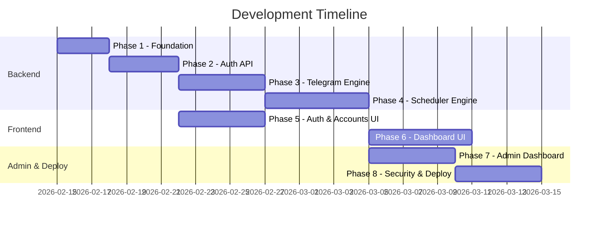

# 📋 Project Phases Roadmap — TG Scheduler User Automation

> **Vision**: "Set once, forget forever." — A web-based system that automates daily Telegram attendance sticker scheduling, eliminating repetitive manual work for employees.

---

## Project Context

### The Problem

Employees must manually send specific attendance stickers (Duty In, Break Start, Break End, Duty Out) at fixed times every day in a Telegram group. Since Telegram Premium is unavailable, they cannot use Telegram's built-in scheduling. This daily process is **repetitive**, **time-consuming**, and **easy to forget**.

### The Solution

A VPS-hosted web application where users connect their Telegram accounts once, define their daily schedule once, and the system automatically sends the correct stickers at the correct times every day — including intelligent off-day handling.

### Architecture Summary

| Layer      | Technology                                      |
|------------|--------------------------------------------------|
| Backend    | Python + Telethon/Pyrogram + REST API + Scheduler |
| Frontend   | React (Vite) + shadcn + Tailwind + Zod + RHF    |
| Database   | MongoDB Atlas                                    |
| Hosting    | VPS (24/7 running)                               |

### Available Skills (Best Practices to Follow)

| Skill | When to Apply |
|-------|---------------|
| `rest-api-design` | Phase 2 — When designing all API endpoints (resource naming, status codes, error responses, versioning) |
| `python-performance-optimization` | Phase 3, 4, 7 — When building the scheduler engine, background workers, and optimizing performance |
| `vercel-react-best-practices` | Phase 5, 6 — When building React components, optimizing bundle size, handling re-renders, and client-side data fetching |

---

## Phase 1 — Project Foundation & Environment Setup

### Purpose
Establish the development environment, project structure, dependency management, and tooling so that all subsequent phases have a solid, consistent foundation to build upon.

### Previously
Nothing exists yet — this is a fresh project with only a `project_overview.md`, a `README.md`, and skill reference files.

### Intention
Create a well-organized monorepo or structured directory layout with separate `backend/` and `frontend/` folders. Install all core dependencies, configure linters/formatters, set up environment variable management, and establish the Git workflow.

### Result
A fully configured development environment where both the Python backend and React frontend can be started locally with a single command each. All tooling (linting, formatting, env management) is in place.

### Tasks

#### 1.1 — Backend Foundation
- [ ] Create `backend/` directory structure:
  ```
  backend/
  ├── app/
  │   ├── __init__.py
  │   ├── main.py              # Entry point
  │   ├── config.py            # Environment config
  │   ├── database.py          # MongoDB connection
  │   ├── models/              # Database models
  │   ├── routes/              # API route handlers
  │   ├── services/            # Business logic
  │   ├── middleware/           # Auth, rate limiting
  │   ├── scheduler/           # Background job scheduler
  │   └── utils/               # Helpers, encryption
  ├── requirements.txt
  ├── .env.example
  └── .env
  ```
- [ ] Initialize Python virtual environment
- [ ] Install core dependencies:
  - `fastapi` or `flask` (REST API framework)
  - `uvicorn` (ASGI server)
  - `motor` (async MongoDB driver)
  - `telethon` or `pyrogram` (Telegram userbot library)
  - `apscheduler` (background scheduler)
  - `python-jose` + `passlib` (JWT auth + password hashing)
  - `python-dotenv` (environment variables)
  - `cryptography` (session encryption)
  - `pydantic` (data validation)
- [ ] Create `.env.example` with all required environment variables:
  - `MONGO_URI`, `JWT_SECRET`, `ENCRYPTION_KEY`, `TELEGRAM_API_ID`, `TELEGRAM_API_HASH`
- [ ] Set up basic `config.py` to load and validate environment variables

#### 1.2 — Frontend Foundation
- [ ] Initialize React project with Vite in `frontend/` directory:
  - `npx -y create-vite@latest ./frontend --template react`
- [ ] Install core dependencies:
  - `shadcn/ui` components
  - `tailwindcss` + configuration
  - `react-hook-form` + `@hookform/resolvers`
  - `zod` (schema validation)
  - `react-hot-toast` (notifications)
  - `axios` (HTTP client)
  - `react-router-dom` (routing)
- [ ] Configure Tailwind with custom theme (dark mode support, mobile-first breakpoints)
- [ ] Set up project structure:
  ```
  frontend/src/
  ├── components/          # Reusable UI components
  │   ├── ui/              # shadcn components
  │   └── layout/          # Layout wrappers
  ├── pages/               # Page components
  ├── hooks/               # Custom React hooks
  ├── services/            # API service layer
  ├── lib/                 # Utilities
  ├── contexts/            # React contexts
  └── schemas/             # Zod validation schemas
  ```

#### 1.3 — Database Setup
- [ ] Create MongoDB Atlas cluster
- [ ] Configure connection string in `.env`
- [ ] Create `database.py` with connection pooling and health check
- [ ] Design initial collections schema (documented, not yet implemented):
  - `users` — system accounts
  - `telegram_accounts` — connected TG accounts
  - `schedules` — daily time configurations
  - `off_days` — excluded dates/days
  - `activity_logs` — send success/failure records

#### 1.4 — Git & Tooling
- [ ] Set up `.gitignore` for Python + Node artifacts, `.env`, session files
- [ ] Add `README.md` with setup instructions for both backend and frontend
- [ ] Create `docker-compose.yml` (optional, for local MongoDB)

---

## Phase 2 — Authentication & User Management API

> **🔧 Skill**: Apply `rest-api-design` for all endpoint design — resource naming (nouns, plural), proper HTTP methods, status codes, error response format, and input validation.

### Purpose
Build the user registration, login, and session management system that will gate all subsequent features. Without authentication, nothing else can be personalized or secured.

### Previously
Phase 1 is complete — the project structure exists, dependencies are installed, and the database connection is configured.

### Intention
Create a complete auth flow: registration with email/password, login with JWT tokens, middleware for protected routes, and password hashing. Also build the admin role system so that admin-specific features (Phase 7) have a foundation.

### Result
Users can register, log in, receive a JWT token, and use that token to access protected API endpoints. Passwords are never stored in plaintext. Admin users can be distinguished from regular users.

### Tasks

#### 2.1 — User Model
- [ ] Create `User` model in MongoDB:
  ```python
  {
    "_id": ObjectId,
    "email": str,             # unique, indexed
    "password_hash": str,     # bcrypt hashed
    "role": str,              # "user" | "admin"
    "is_active": bool,        # account lock status
    "telegram_account_limit": int,  # max TG accounts allowed (default: 3)
    "created_at": datetime,
    "updated_at": datetime
  }
  ```
- [ ] Add email uniqueness index
- [ ] Add input validation with Pydantic schemas

#### 2.2 — Auth API Endpoints
Following `rest-api-design` skill — nouns, plural resources, proper status codes:

| Method | Endpoint | Purpose | Status Codes |
|--------|----------|---------|-------------|
| `POST` | `/api/v1/auth/register` | Create new user account | `201`, `400`, `409` |
| `POST` | `/api/v1/auth/login` | Authenticate & return JWT | `200`, `401` |
| `GET` | `/api/v1/auth/me` | Get current user profile | `200`, `401` |
| `PATCH` | `/api/v1/auth/me` | Update profile | `200`, `400`, `401` |
| `POST` | `/api/v1/auth/change-password` | Change password | `200`, `400`, `401` |

- [ ] Implement registration with email validation (format check, uniqueness)
- [ ] Implement login returning JWT access token (with expiry)
- [ ] Implement password hashing with `bcrypt` via `passlib`
- [ ] Implement JWT token generation and verification with `python-jose`

#### 2.3 — Auth Middleware
- [ ] Create `auth_middleware` that:
  - Extracts JWT from `Authorization: Bearer <token>` header
  - Validates token signature and expiry
  - Attaches `current_user` to request context
  - Returns `401` for invalid/missing tokens
- [ ] Create `admin_middleware` that checks `role == "admin"`
- [ ] Create `rate_limit_middleware` to prevent brute force login attempts

#### 2.4 — Error Response Format
Following `rest-api-design` skill — standardized error responses:
```json
{
  "error": {
    "code": "VALIDATION_ERROR",
    "message": "Invalid input data",
    "details": [
      { "field": "email", "message": "Email format is invalid" }
    ]
  }
}
```
- [ ] Create a centralized error handler that formats all errors consistently
- [ ] Ensure all endpoints return proper HTTP status codes

---

## Phase 3 — Telegram Account Connection Engine

> **🔧 Skill**: Apply `python-performance-optimization` for async I/O patterns (Pattern 15) when handling Telegram API calls. Apply `rest-api-design` for endpoint design.

### Purpose
Build the core engine that allows users to connect their Telegram accounts to the system. This is the most critical and sensitive phase because it involves handling real Telegram sessions and login codes.

### Previously
Phase 2 is complete — users can register and log in. The auth middleware protects routes. But users have no Telegram accounts connected yet.

### Intention
Create a multi-step Telegram login flow: user provides phone number → system sends login code via Telegram → user enters code → session is created and encrypted. The session file is stored securely so the system can act as the user on Telegram without re-authentication.

### Result
Users can connect one or more Telegram accounts. Each account has an encrypted session stored on the server. The system can act as the user to send messages/stickers in Telegram groups. Users can view, manage, and disconnect their accounts.

### Tasks

#### 3.1 — Telegram Client Manager
- [ ] Create `TelegramClientManager` service:
  - Manages multiple Telethon/Pyrogram clients
  - One client per connected Telegram account
  - Handles client lifecycle (connect, disconnect, reconnect)
- [ ] Implement session encryption:
  - Encrypt session files using `cryptography.fernet` with `ENCRYPTION_KEY`
  - Store encrypted sessions in a `sessions/` directory (excluded from git)
  - Decrypt only when client needs to connect
- [ ] Implement connection pooling:
  - Keep active clients in memory for accounts with active schedules
  - Lazy-load clients for inactive accounts

#### 3.2 — Telegram Account Model
- [ ] Create `TelegramAccount` model:
  ```python
  {
    "_id": ObjectId,
    "user_id": ObjectId,          # references User
    "phone_number": str,          # +880XXXXXXX
    "telegram_user_id": int,      # Telegram's internal user ID
    "first_name": str,            # from Telegram profile
    "username": str,              # @username if available
    "session_file": str,          # path to encrypted session
    "status": str,                # "active" | "disconnected" | "locked"
    "is_locked_by_admin": bool,   # admin lock flag
    "last_activity": datetime,
    "created_at": datetime
  }
  ```
- [ ] Add compound index on `(user_id, phone_number)` for uniqueness
- [ ] Add index on `user_id` for fast lookups

#### 3.3 — Telegram Connection API
| Method | Endpoint | Purpose | Status Codes |
|--------|----------|---------|-------------|
| `GET` | `/api/v1/telegram-accounts` | List user's connected accounts | `200`, `401` |
| `POST` | `/api/v1/telegram-accounts/send-code` | Start login: send code to phone | `200`, `400`, `429` |
| `POST` | `/api/v1/telegram-accounts/verify-code` | Complete login: verify code | `201`, `400`, `401` |
| `GET` | `/api/v1/telegram-accounts/:id` | Get account details | `200`, `401`, `404` |
| `DELETE` | `/api/v1/telegram-accounts/:id` | Disconnect & remove account | `204`, `401`, `404` |
| `POST` | `/api/v1/telegram-accounts/:id/reconnect` | Reconnect a disconnected session | `200`, `400` |

- [ ] Implement the two-step login flow:
  1. `send-code`: Creates a temporary Telethon client, sends login code, stores `phone_code_hash` in a temporary cache (with TTL)
  2. `verify-code`: Verifies the code, completes login, saves encrypted session, creates DB record
- [ ] Enforce `telegram_account_limit` from user profile
- [ ] Handle 2FA (two-factor authentication) if user has it enabled on Telegram
- [ ] Handle `FloodWaitError` from Telegram API with proper retry messaging

#### 3.4 — Session Health Monitoring
- [ ] Create a background task that periodically checks session health:
  - Attempt to connect with each active session
  - Mark `status: "disconnected"` if session is expired/revoked
  - Log health check results
- [ ] Implement auto-reconnect logic for temporarily disconnected sessions

---

## Phase 4 — Scheduler Engine & Sticker/Group Setup

> **🔧 Skill**: Apply `python-performance-optimization` for efficient scheduling (Pattern 12 caching, Pattern 14 multiprocessing, Pattern 15 async I/O). Apply `rest-api-design` for endpoints.

### Purpose
Build the heart of the system — the background scheduler that sends stickers at the right times, and the setup flows that let users choose their target group, stickers, and schedule times.

### Previously
Phase 3 is complete — users have connected Telegram accounts with encrypted sessions. But there's no scheduling, no sticker selection, and no group selection yet.

### Intention
Create three interconnected features:
1. **Group Selection** — Let users pick their attendance Telegram group from their joined groups
2. **Sticker Selection** — Let users assign specific stickers to each duty event
3. **Schedule Configuration** — Let users set daily times for each event
4. **Background Worker** — The engine that actually sends stickers at the correct times

### Result
The automation is fully functional. Users set a schedule once, and the system sends the correct stickers to the correct group at the correct times every day. Off days pause the automation. The system retries on failure and logs everything.

### Tasks

#### 4.1 — Group Setup
- [ ] Create endpoint to fetch user's joined Telegram groups:
  | Method | Endpoint | Purpose |
  |--------|----------|---------|
  | `GET` | `/api/v1/telegram-accounts/:id/groups` | List joined groups |
  | `PATCH` | `/api/v1/telegram-accounts/:id/group` | Set target group |
- [ ] Use Telethon to fetch dialogs/groups for the connected account
- [ ] Save selected group (ID, title, access_hash) to the `TelegramAccount` document

#### 4.2 — Sticker Setup
- [ ] Create endpoints for sticker management:
  | Method | Endpoint | Purpose |
  |--------|----------|---------|
  | `GET` | `/api/v1/telegram-accounts/:id/sticker-sets` | List user's sticker packs |
  | `GET` | `/api/v1/telegram-accounts/:id/sticker-sets/:set_id/stickers` | List stickers in a pack |
  | `PUT` | `/api/v1/telegram-accounts/:id/stickers` | Save sticker assignments |
  | `GET` | `/api/v1/telegram-accounts/:id/stickers` | Get current sticker assignments |
- [ ] Create `StickerConfig` model embedded in `TelegramAccount` or as a sub-document:
  ```python
  {
    "duty_in_sticker": { "set_id": str, "sticker_id": str, "emoji": str },
    "break_start_sticker": { "set_id": str, "sticker_id": str, "emoji": str },
    "break_end_sticker": { "set_id": str, "sticker_id": str, "emoji": str },
    "duty_out_sticker": { "set_id": str, "sticker_id": str, "emoji": str }
  }
  ```
- [ ] Fetch sticker sets from Telegram using the userbot client
- [ ] Render sticker thumbnails for frontend display

#### 4.3 — Schedule Configuration
- [ ] Create `Schedule` model:
  ```python
  {
    "_id": ObjectId,
    "telegram_account_id": ObjectId,
    "user_id": ObjectId,
    "is_enabled": bool,           # master on/off switch
    "timezone": str,              # e.g., "Asia/Dhaka"
    "duty_in_time": str,          # "09:00" (HH:MM 24hr)
    "break_start_time": str,      # "13:00"
    "break_end_time": str,        # "14:00"
    "duty_out_time": str,         # "18:00"
    "randomize_minutes": int,     # optional: ±N minutes random offset
    "created_at": datetime,
    "updated_at": datetime
  }
  ```
- [ ] Create schedule endpoints:
  | Method | Endpoint | Purpose |
  |--------|----------|---------|
  | `GET` | `/api/v1/telegram-accounts/:id/schedule` | Get schedule config |
  | `PUT` | `/api/v1/telegram-accounts/:id/schedule` | Create/update schedule |
  | `PATCH` | `/api/v1/telegram-accounts/:id/schedule/toggle` | Enable/disable schedule |

#### 4.4 — Off Days Management
- [ ] Create `OffDays` model:
  ```python
  {
    "_id": ObjectId,
    "telegram_account_id": ObjectId,
    "user_id": ObjectId,
    "weekly_holidays": [int],     # 0=Monday, 6=Sunday
    "specific_dates": [str],      # ["2026-02-20", "2026-03-26"]
    "created_at": datetime,
    "updated_at": datetime
  }
  ```
- [ ] Create off days endpoints:
  | Method | Endpoint | Purpose |
  |--------|----------|---------|
  | `GET` | `/api/v1/telegram-accounts/:id/off-days` | Get off days config |
  | `PUT` | `/api/v1/telegram-accounts/:id/off-days` | Update off days |
  | `POST` | `/api/v1/telegram-accounts/:id/off-days/dates` | Add specific date(s) |
  | `DELETE` | `/api/v1/telegram-accounts/:id/off-days/dates` | Remove specific date(s) |

#### 4.5 — Background Scheduler Engine
- [ ] Implement the core scheduler using `APScheduler`:
  - On startup, load all active schedules from the database
  - For each active schedule, create 4 jobs (duty_in, break_start, break_end, duty_out)
  - Jobs run daily at the configured times (accounting for timezone)
  - Before sending, check:
    1. Is the schedule enabled?
    2. Is today an off day (weekly holiday or specific date)?
    3. Is the Telegram account active (not locked, not disconnected)?
    4. Is the group still accessible?
  - If all checks pass → send the sticker
  - If any check fails → log the reason and skip
- [ ] Create `ActivityLog` model:
  ```python
  {
    "_id": ObjectId,
    "telegram_account_id": ObjectId,
    "user_id": ObjectId,
    "event_type": str,       # "duty_in" | "break_start" | "break_end" | "duty_out"
    "status": str,           # "sent" | "failed" | "skipped"
    "reason": str,           # null for success, reason for failure/skip
    "scheduled_time": datetime,
    "actual_sent_time": datetime,  # null if not sent
    "created_at": datetime
  }
  ```
- [ ] Implement retry logic:
  - On failure, retry up to 3 times with exponential backoff (5s, 15s, 45s)
  - Log each retry attempt
  - After 3 failures, mark as "failed" and move on
- [ ] Implement duplicate prevention:
  - Before sending, check if the same event was already sent today
  - Prevent double-sends on server restart
- [ ] Dynamic schedule management:
  - When a user updates their schedule via API, update the APScheduler jobs in real-time
  - When a user disables their schedule, pause the jobs (don't delete)
  - When a user re-enables, resume the jobs

---

## Phase 5 — Frontend: Authentication & Account Management UI

> **🔧 Skill**: Apply `vercel-react-best-practices` — especially `bundle-dynamic-imports` for code splitting, `rerender-memo` for list rendering, `client-swr-dedup` for data fetching, and `rendering-conditional-render` for conditional UI.

### Purpose
Build the user-facing frontend where users can register, log in, and manage their connected Telegram accounts. This is the user's first impression of the system.

### Previously
Phases 2-4 built all the backend APIs. The frontend project was scaffolded in Phase 1 but has no pages or components yet.

### Intention
Create a clean, mobile-first, responsive UI that guides users through registration, login, and Telegram account connection. The design must feel simple, fast, and clear — big buttons, clear status messages, and easy navigation.

### Result
Users can register, log in, see a list of their connected Telegram accounts, add new accounts via the two-step phone code flow, and navigate to individual account dashboards.

### Tasks

#### 5.1 — Auth Pages
- [ ] Create `LoginPage` with email/password form:
  - Zod schema for validation
  - react-hook-form for form management
  - Error display for invalid credentials
  - "Register" link
- [ ] Create `RegisterPage` with email/password/confirm-password form:
  - Password strength indicator
  - Email format validation
  - Success → redirect to login
- [ ] Create `AuthContext` for token management:
  - Store JWT in memory (not localStorage for security)
  - Auto-refresh mechanism
  - Logout functionality
- [ ] Create `ProtectedRoute` wrapper component
- [ ] Set up `axios` instance with:
  - Base URL from environment
  - Auth token interceptor
  - Error response interceptor (auto-redirect on 401)

#### 5.2 — Telegram Accounts List Page
- [ ] Create `TelegramAccountsPage` — the landing page after login:
  - Lists all connected Telegram accounts as cards
  - Each card shows: phone number, name, status badge (Active/Disconnected/Locked), last activity
  - "Add Telegram Account" button (prominent, large)
  - Empty state when no accounts connected
- [ ] Create `AccountCard` component:
  - Status color coding (green=active, yellow=disconnected, red=locked)
  - Click → navigate to account dashboard
  - Delete button with confirmation dialog

#### 5.3 — Add Telegram Account Flow
- [ ] Create `AddAccountDialog` (modal or full-page):
  - **Step 1**: Phone number input with country code selector
    - Format: `+880 1XXX-XXXXXX`
    - Submit → calls `send-code` API
    - Show loading spinner while waiting for code
  - **Step 2**: Verification code input
    - 5-digit code input with auto-focus
    - Resend code timer (60 seconds)
    - Submit → calls `verify-code` API
    - Handle 2FA password step if needed
  - **Step 3**: Success confirmation
    - Show connected account details
    - "Go to Dashboard" button
- [ ] Handle errors gracefully:
  - Phone number already connected
  - Invalid code
  - Flood wait (show timer)
  - Account limit reached

#### 5.4 — Layout & Navigation
- [ ] Create `AppLayout` with:
  - Top header bar with app name, user email, logout button
  - Mobile-first responsive design
  - Clean, minimal aesthetic
- [ ] Set up React Router:
  - `/login` → LoginPage
  - `/register` → RegisterPage
  - `/accounts` → TelegramAccountsPage
  - `/accounts/:id/*` → Account Dashboard (Phase 6)
- [ ] Implement toast notifications using `react-hot-toast`:
  - Success: "Account connected successfully"
  - Error: "Failed to connect. Try again."
  - Info: "Verification code sent to your Telegram"

---

## Phase 6 — Frontend: Account Dashboard & Setup Pages

> **🔧 Skill**: Apply `vercel-react-best-practices` — `rendering-content-visibility` for sticker grid rendering, `rerender-derived-state` for schedule state management, `async-parallel` for parallel data fetching, `bundle-preload` for navigation preloading.

### Purpose
Build the per-account dashboard where users configure their schedule, select stickers, choose the target group, and manage off days. This is where the core user experience lives.

### Previously
Phase 5 built the auth UI and accounts list page. Users can connect Telegram accounts. But they cannot configure anything yet — no schedule, no stickers, no group selection.

### Intention
Create a tabbed/sidebar dashboard for each Telegram account with four sections: Scheduler, Sticker Setup, Group Setup, and Off Days. The UI must clearly show the current status of the automation and guide users through the one-time setup process.

### Result
Users can fully configure their automation from the browser: select a group, assign stickers, set schedule times, mark off days, and enable/disable the automation. The dashboard shows real-time status like "Next duty in sticker will send at 11:00 AM" or "Scheduler paused (Off day)".

### Tasks

#### 6.1 — Account Dashboard Layout
- [ ] Create `AccountDashboard` with:
  - **Desktop**: Sidebar navigation (Scheduler, Sticker Setup, Group Setup, Off Days)
  - **Mobile**: Bottom tab navigation (same 4 tabs)
  - Header showing account phone number, status badge, and a back button to accounts list
- [ ] Create nested routes:
  - `/accounts/:id/scheduler` → SchedulerPage
  - `/accounts/:id/stickers` → StickerSetupPage
  - `/accounts/:id/group` → GroupSetupPage
  - `/accounts/:id/off-days` → OffDaysPage

#### 6.2 — Scheduler Page
- [ ] Create `SchedulerPage`:
  - **Status Banner** at top:
    - If schedule enabled: "✅ Automation Active — Next: Duty In at 11:00 AM"
    - If schedule disabled: "⏸️ Automation Paused"
    - If off day: "🏖️ Today is an off day — automation paused"
    - If missing setup: "⚠️ Complete sticker and group setup first"
  - **Time Configuration** form:
    - 4 time pickers: Duty In, Break Start, Break End, Duty Out
    - Timezone selector (default: Asia/Dhaka)
    - Save button
  - **Master Toggle** switch: Enable/Disable automation
  - **Recent Activity** section:
    - Table showing last 10 sends (event type, time, status)
    - Color-coded: green=sent, red=failed, gray=skipped

#### 6.3 — Sticker Setup Page
- [ ] Create `StickerSetupPage`:
  - Show user's sticker packs as a dropdown/accordion
  - When a pack is selected, show grid of sticker thumbnails
  - 4 assignment slots: Duty In, Break Start, Break End, Duty Out
  - User clicks a sticker → it's assigned to the currently active slot
  - Visual preview of all 4 assigned stickers
  - Save button
  - Clear assignments option

#### 6.4 — Group Setup Page
- [ ] Create `GroupSetupPage`:
  - Fetch and display user's joined Telegram groups
  - Each group shown as a selectable card (name, member count if available)
  - Currently selected group highlighted
  - "Refresh Groups" button (in case user joins new groups)
  - Save selection

#### 6.5 — Off Days Page
- [ ] Create `OffDaysPage`:
  - **Weekly Holidays** section:
    - 7 day toggle buttons (Mon-Sun)
    - e.g., Friday and Saturday toggled ON = weekly off
  - **Specific Dates** section:
    - Calendar date picker to add specific off dates
    - List of added dates with remove button
    - Bulk add option for known holidays
  - **Upcoming Off Days** preview:
    - Shows next 5 off days with reason (weekly/specific)

---

## Phase 7 — Admin Dashboard & System Controls

> **🔧 Skills**: Apply `rest-api-design` for admin API endpoints. Apply `vercel-react-best-practices` for admin React components.

### Purpose
Build the admin panel that gives system administrators full visibility and control over all users, Telegram accounts, and the scheduler engine. This is essential for system management, abuse prevention, and operational stability.

### Previously
Phases 1-6 built the complete user-facing system — registration, Telegram connection, scheduling, and the frontend. But there's no way for an admin to monitor or control the system.

### Intention
Create a dedicated admin dashboard with user management (view, lock, delete users), Telegram account control (lock accounts, stop schedulers), and system controls (server restart, log management, database backup). The admin should have complete visibility into system health.

### Result
Admins can monitor all users and their activity, lock/unlock accounts, control Telegram account limits, and perform system maintenance — all from a web interface. The admin can intervene quickly if abuse is detected or the system needs attention.

### Tasks

#### 7.1 — Admin API Endpoints
All admin endpoints require `admin_middleware`:

| Method | Endpoint | Purpose |
|--------|----------|---------|
| `GET` | `/api/v1/admin/users` | List all users with stats |
| `GET` | `/api/v1/admin/users/:id` | Get user details + accounts |
| `PATCH` | `/api/v1/admin/users/:id` | Update user (lock, set limits) |
| `DELETE` | `/api/v1/admin/users/:id` | Delete user + all their data |
| `GET` | `/api/v1/admin/telegram-accounts` | List all TG accounts system-wide |
| `PATCH` | `/api/v1/admin/telegram-accounts/:id/lock` | Lock a TG account |
| `PATCH` | `/api/v1/admin/telegram-accounts/:id/unlock` | Unlock a TG account |
| `POST` | `/api/v1/admin/system/restart` | Restart the scheduler engine |
| `DELETE` | `/api/v1/admin/system/logs` | Clear old activity logs |
| `POST` | `/api/v1/admin/system/backup` | Trigger database backup |
| `GET` | `/api/v1/admin/system/health` | System health status |
| `GET` | `/api/v1/admin/dashboard/stats` | Aggregate stats for dashboard |

#### 7.2 — Admin Dashboard UI
- [ ] Create admin-specific routes (protected by admin role check):
  - `/admin` → Admin Dashboard overview
  - `/admin/users` → User Management
  - `/admin/telegram-accounts` → TG Account Control
  - `/admin/system` → System Controls
- [ ] **Admin Overview Dashboard**:
  - Total users count
  - Total connected Telegram accounts
  - Active schedules count
  - Today's sent/failed/skipped counts
  - System health indicator (scheduler running, DB connected)
- [ ] **User Management Page**:
  - Searchable, paginated user table
  - Columns: email, role, status, TG accounts count, created date
  - Actions: lock/unlock, delete (with confirmation), change TG account limit
- [ ] **TG Account Control Page**:
  - Table of all connected Telegram accounts across all users
  - Columns: phone, owner email, status, schedule status, last activity
  - Actions: lock/unlock, stop scheduler
- [ ] **System Controls Page**:
  - Restart scheduler engine button
  - Clear logs older than N days
  - Backup database button
  - System health details (uptime, memory usage, active clients count)

---

## Phase 8 — Security Hardening, Testing, & VPS Deployment

> **🔧 Skills**: Apply `python-performance-optimization` for production performance tuning. Apply `rest-api-design` for API rate limiting patterns.

### Purpose
Harden the system for production use, write tests for critical flows, and deploy to a VPS that runs 24/7. This is the final phase that transforms a development project into a reliable production system.

### Previously
Phases 1-7 built the complete system — user auth, Telegram connection, scheduling engine, frontend, and admin panel — all working in development.

### Intention
Address all security concerns (session encryption verification, rate limiting, input sanitization, error masking), write automated tests for critical paths (auth flow, schedule creation, sticker sending), set up the VPS with proper process management, and deploy both backend and frontend for production use.

### Result
The system is live on a VPS, accessible via a domain, running 24/7 with proper process management (systemd/PM2), encrypted sessions, rate-limited APIs, and monitoring. Users can access the system from any browser, and it reliably sends stickers day after day.

### Tasks

#### 8.1 — Security Hardening
- [ ] Verify session encryption:
  - Audit that no raw session files exist on disk
  - Test encryption/decryption round-trip
  - Ensure `ENCRYPTION_KEY` rotation plan exists
- [ ] Implement API rate limiting:
  - Login: 5 attempts / 15 minutes per IP
  - Registration: 3 per hour per IP
  - Telegram code requests: 3 per 10 minutes per user
  - General API: 100 requests / minute per user
- [ ] Input sanitization:
  - Validate all inputs with Pydantic
  - Sanitize phone numbers (strip non-numeric, validate format)
  - Prevent NoSQL injection in MongoDB queries
- [ ] Error masking:
  - In production, never expose stack traces to the client
  - Log detailed errors server-side only
  - Generic error messages for 500s
- [ ] CORS configuration:
  - Allow only the frontend domain
- [ ] Helmet-equivalent headers (if using a proxy like Nginx)

#### 8.2 — Testing
- [ ] Backend unit tests:
  - Auth registration & login
  - JWT token generation & validation
  - Schedule creation & validation
  - Off-day check logic
  - Encryption/decryption
- [ ] Backend integration tests:
  - Full auth flow (register → login → access protected route)
  - Telegram account CRUD (mock Telegram API)
  - Schedule CRUD + toggle
- [ ] Frontend component tests:
  - Login form validation
  - Account card rendering
  - Schedule form submission
- [ ] End-to-end testing:
  - Use a test Telegram account
  - Full flow: register → login → connect TG → set group → set stickers → set schedule → verify sticker is sent

#### 8.3 — VPS Deployment
- [ ] Server setup:
  - Ubuntu VPS with SSH access
  - Install Python 3.11+, Node.js 18+
  - Install Nginx as reverse proxy
  - Install Certbot for SSL (Let's Encrypt)
- [ ] Backend deployment:
  - Create `systemd` service for the Python backend:
    ```ini
    [Unit]
    Description=TG Scheduler Backend
    After=network.target
    
    [Service]
    User=appuser
    WorkingDirectory=/opt/tg-scheduler/backend
    EnvironmentFile=/opt/tg-scheduler/.env
    ExecStart=/opt/tg-scheduler/venv/bin/uvicorn app.main:app --host 0.0.0.0 --port 8000
    Restart=always
    RestartSec=5
    
    [Install]
    WantedBy=multi-user.target
    ```
  - Auto-restart on crash
  - Log rotation with `journald`
- [ ] Frontend deployment:
  - Build production bundle: `npm run build`
  - Serve via Nginx static file serving
- [ ] Nginx configuration:
  - Proxy `/api/*` to Python backend (port 8000)
  - Serve frontend static files from `/`
  - SSL termination with Let's Encrypt
  - Gzip compression
- [ ] Domain setup:
  - Point domain/subdomain to VPS IP
  - SSL certificate via Certbot
- [ ] Monitoring:
  - Set up basic uptime monitoring (UptimeRobot or similar)
  - Log aggregation (journald or simple file logging)
  - Alert on consecutive scheduler failures (optional: Telegram bot notification to admin)

---

## Phase Summary Matrix

| Phase | Name | Depends On | Key Deliverable | Skill Applied |
|-------|------|------------|-----------------|---------------|
| 1 | Foundation & Setup | — | Project structure, deps, DB connection | — |
| 2 | Auth & User Management | Phase 1 | Register/login API, JWT middleware | `rest-api-design` |
| 3 | Telegram Connection | Phase 2 | Multi-account TG login, encrypted sessions | `rest-api-design`, `python-performance` |
| 4 | Scheduler & Setup | Phase 3 | Background sticker sender, group/sticker/schedule config | `rest-api-design`, `python-performance` |
| 5 | Frontend: Auth & Accounts | Phase 2 | Login UI, accounts list, TG connection flow | `vercel-react-best-practices` |
| 6 | Frontend: Dashboard | Phase 4, 5 | Scheduler UI, sticker/group setup, off days | `vercel-react-best-practices` |
| 7 | Admin Dashboard | Phase 4, 5 | Admin panel, user/account control, system management | `rest-api-design`, `vercel-react-best-practices` |
| 8 | Security, Testing, Deploy | Phase 1-7 | Hardened, tested, production-deployed system | `python-performance`, `rest-api-design` |

---

## Parallel Work Opportunities

Some phases can overlap to speed up development:



> **Note**: Phase 5 (Frontend Auth) can start as soon as Phase 2 (Auth API) is complete, running in parallel with Phases 3-4 (Backend Telegram & Scheduler).

---

## How to Use This Roadmap

1. **Follow phases sequentially** (1 → 2 → 3 → 4...) unless noted for parallel work
2. **Before starting each phase**, re-read the **Purpose** and **Previously** sections to understand context
3. **Check off tasks** as you complete them within each phase
4. **Apply skills** as indicated — read the full SKILL.md before starting the relevant phase
5. **Test each phase independently** before moving to the next
6. **The Result section** tells you what "done" looks like for each phase

> 🎯 **End Goal**: A production-deployed system on a VPS where employees connect their Telegram once, set their schedule once, and the system handles daily attendance stickers automatically — forever.
